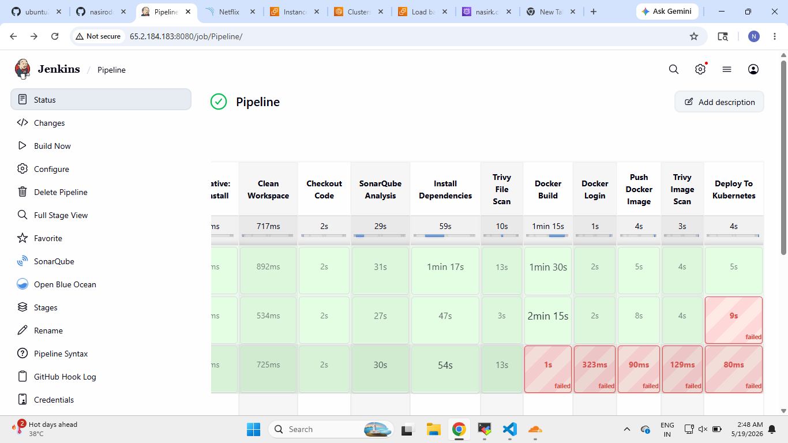
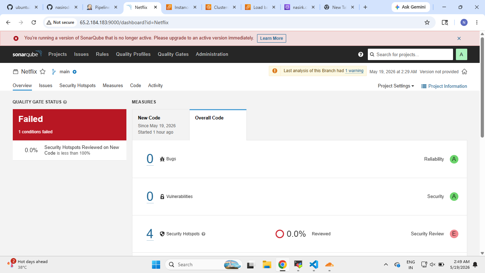
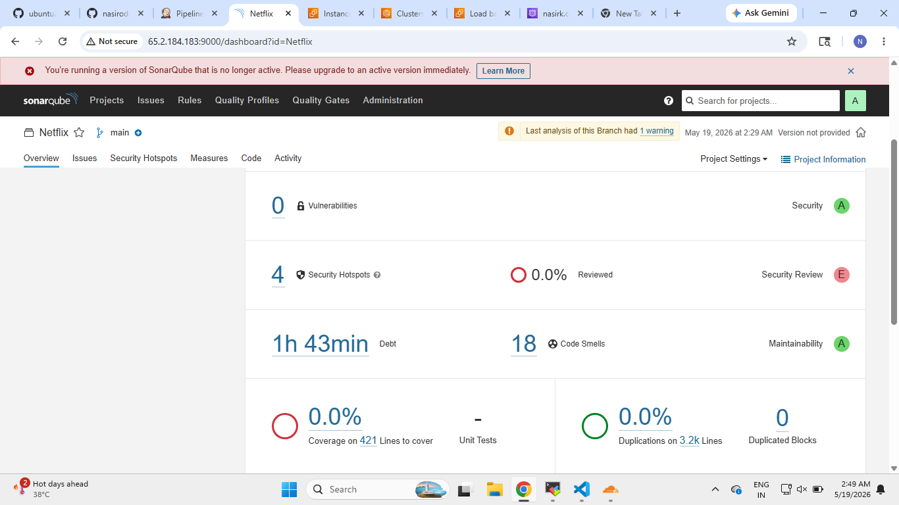
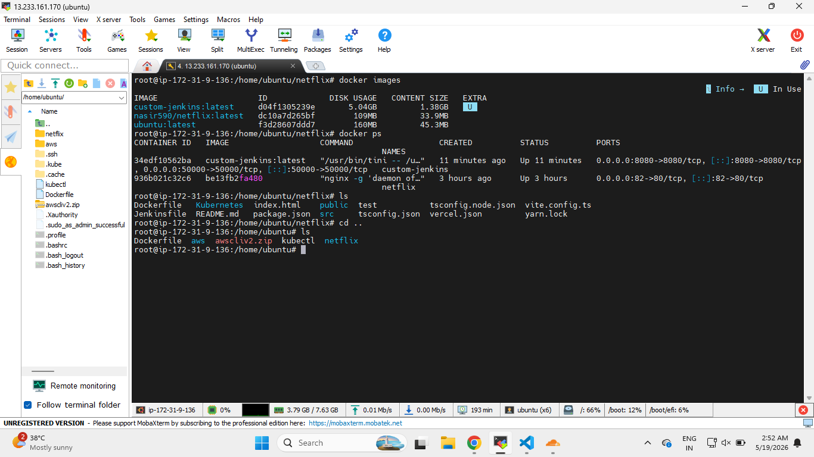
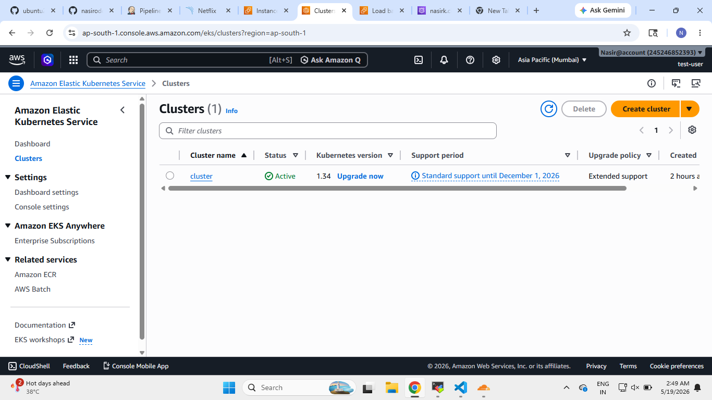
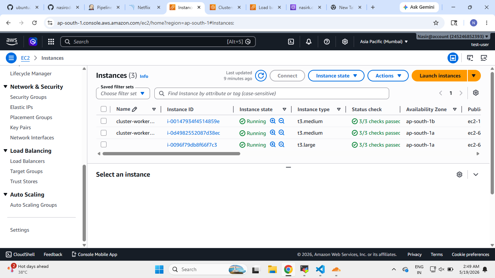
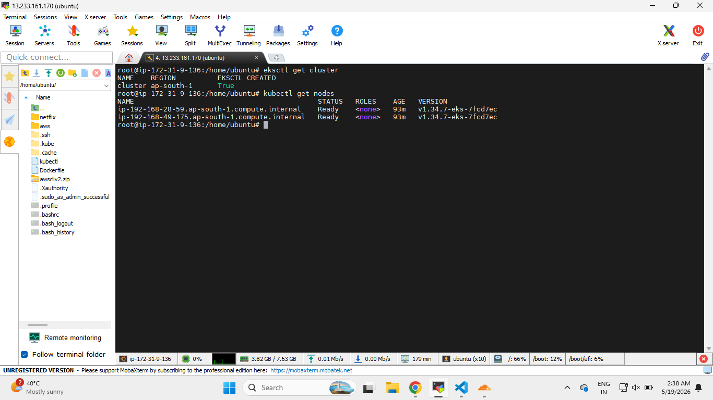
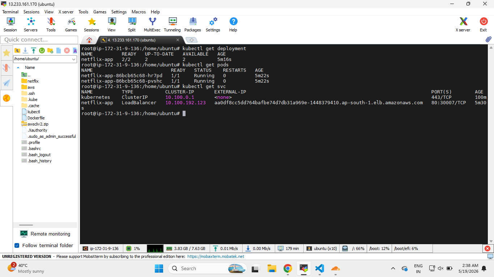
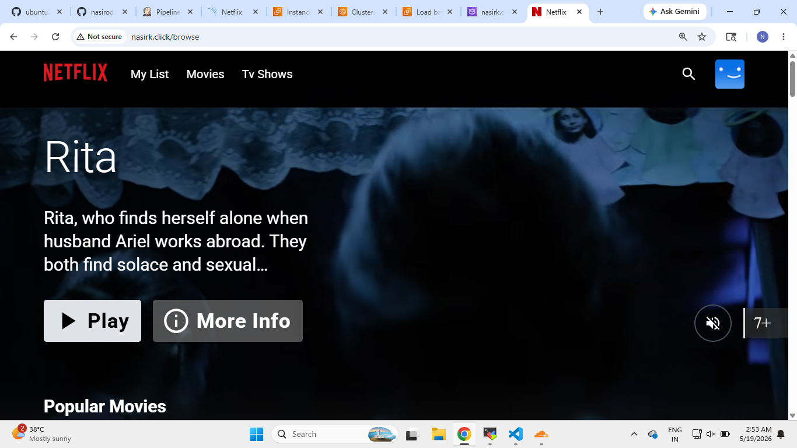
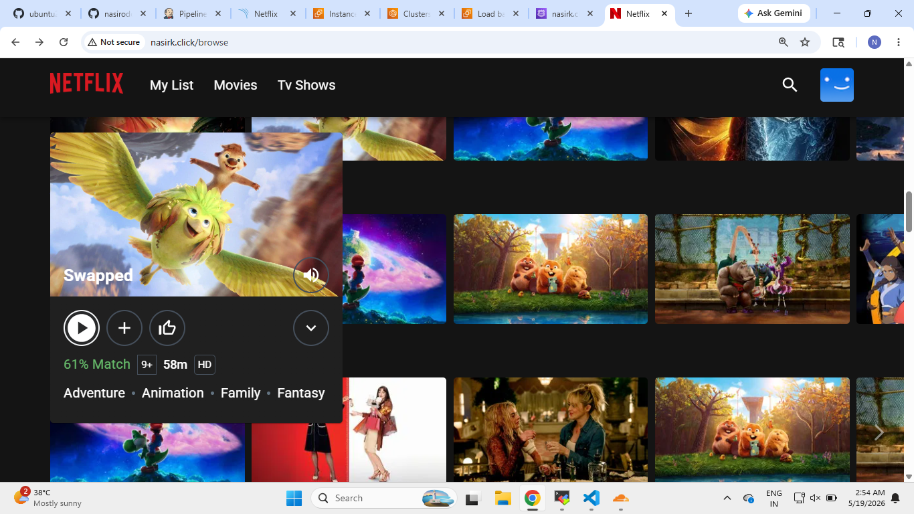

# 🎬 Netflix Clone DevSecOps CI/CD Pipeline Project

## 📌 Project Overview

This project demonstrates a complete **DevSecOps CI/CD Pipeline** for deploying a **Netflix Clone Application** using:

- React + TypeScript + Vite
- Docker
- Jenkins
- SonarQube
- Trivy
- Kubernetes
- Amazon EKS
- AWS LoadBalancer

The application is containerized, scanned for vulnerabilities, pushed to Docker Hub, and deployed automatically to Amazon EKS using Jenkins Pipeline.

---

# 🚀 Complete CI/CD Workflow

```text
Developer Pushes Code
↓
GitHub Repository
↓
Jenkins Pipeline Trigger
↓
Clean Workspace
↓
Checkout Source Code
↓
SonarQube Code Analysis
↓
Install Dependencies
↓
Trivy Filesystem Scan
↓
Docker Image Build
↓
Docker Image Push to Docker Hub
↓
Trivy Image Scan
↓
Deploy to Kubernetes (Amazon EKS)
↓
Kubernetes LoadBalancer Service Created
↓
AWS Elastic LoadBalancer Provisioned
↓
Kubernetes Pods Running Successfully
↓
Netflix Application Accessible Publicly
```

---

# 🛠️ Technologies Used

## Frontend
- React
- TypeScript
- Vite
- Material UI

## DevOps & Cloud
- GitHub
- Jenkins
- SonarQube
- Trivy
- Docker
- Kubernetes
- Amazon EKS
- AWS EC2
- AWS Elastic LoadBalancer

---

---

# 🔄 Step 1 — Developer Pushes Code To GitHub

The CI/CD pipeline starts when the developer pushes the application source code to the GitHub repository.


---

# ⚙️ Step 2 — Jenkins Pipeline Triggered

Jenkins automatically triggers the pipeline after detecting changes from GitHub.

Pipeline stages include:

- Clean Workspace
- Checkout Code
- SonarQube Analysis
- Install Dependencies
- Trivy Filesystem Scan
- Docker Build
- Docker Push
- Trivy Image Scan
- Kubernetes Deployment

## 📸 Jenkins CI/CD Pipeline



---

# 🔍 Step 3 — SonarQube Code Analysis

SonarQube performs static code analysis to identify:

- Bugs
- Vulnerabilities
- Security Hotspots
- Code Smells
- Maintainability Issues

## 📸 SonarQube Quality Gate Overview



---

## 📸 SonarQube Code Quality Metrics



---

# 📦 Step 4 — Install Dependencies

Jenkins installs all required Node.js dependencies using:

```bash
npm install
```

This ensures all required packages are available before building the Docker image.

---

# 🛡️ Step 5 — Trivy Filesystem Scan

Trivy scans the source code filesystem for:

- Vulnerabilities
- Secrets
- Misconfigurations

```bash
trivy fs .
```

---

# 🐳 Step 6 — Docker Image Build

The application is containerized using Docker.

A multi-stage Docker build is used for optimized production deployment.

## 📸 Docker Images and Containers



---

# 📤 Step 7 — Push Docker Image To Docker Hub

After successful build, Jenkins pushes the Docker image to Docker Hub.

```bash
docker push nasir590/netflix:latest
```

---

# 🔐 Step 8 — Trivy Docker Image Scan

Trivy scans the Docker image for vulnerabilities before deployment.

```bash
trivy image nasir590/netflix:latest
```

This adds an additional security layer to the CI/CD pipeline.

---

# ☸️ Step 9 — Deploy Application To Kubernetes

Jenkins deploys the application to Amazon EKS using Kubernetes manifests.

Deployment includes:

- Kubernetes Deployment
- Kubernetes Service
- AWS LoadBalancer

---

# ☁️ Step 10 — Amazon EKS Cluster

The Kubernetes cluster is running on Amazon EKS.

## 📸 Amazon EKS Cluster



---

# 🖥️ Step 11 — AWS EC2 Worker Nodes

Amazon EKS worker nodes are running on EC2 instances.

## 📸 AWS EC2 Instances



---

# ⚙️ Step 12 — Kubernetes Cluster and Worker Nodes

The Kubernetes cluster and worker nodes are successfully configured and running.

## 📸 EKS Cluster and Worker Nodes



---

# 🚀 Step 13 — Kubernetes Deployments and Pods

Kubernetes successfully creates:

- Deployments
- ReplicaSets
- Pods
- LoadBalancer Service

## 📸 Kubernetes Deployments and Pods



---

# 🌐 Step 14 — Application Accessible Publicly

AWS Elastic LoadBalancer exposes the application publicly.

The Netflix Clone application is successfully accessible from the browser.

---

# 🎬 Netflix Application Homepage

## 📸 Homepage



---

# 🎞️ Netflix Movie Section

## 📸 Movie Section



---

---

# 🔥 Key Features

✅ Automated CI/CD Pipeline  
✅ Docker Containerization  
✅ SonarQube Code Analysis  
✅ Trivy Security Scanning  
✅ Kubernetes Deployment  
✅ Amazon EKS Integration  
✅ AWS LoadBalancer  
✅ Public Application Access  
✅ Multi-stage Docker Build  
✅ Real-world DevSecOps Workflow  

---

# 📌 Learning Outcomes

This project helped in understanding:

- CI/CD Pipeline Automation
- Jenkins Pipeline Creation
- Docker Image Management
- Kubernetes Deployment
- Amazon EKS Setup
- DevSecOps Security Scanning
- Container Orchestration
- Cloud Deployment Strategies

---

# 👨‍💻 Author

## Nasir Khatib

GitHub:
https://github.com/nasiroddin-khatib

---
